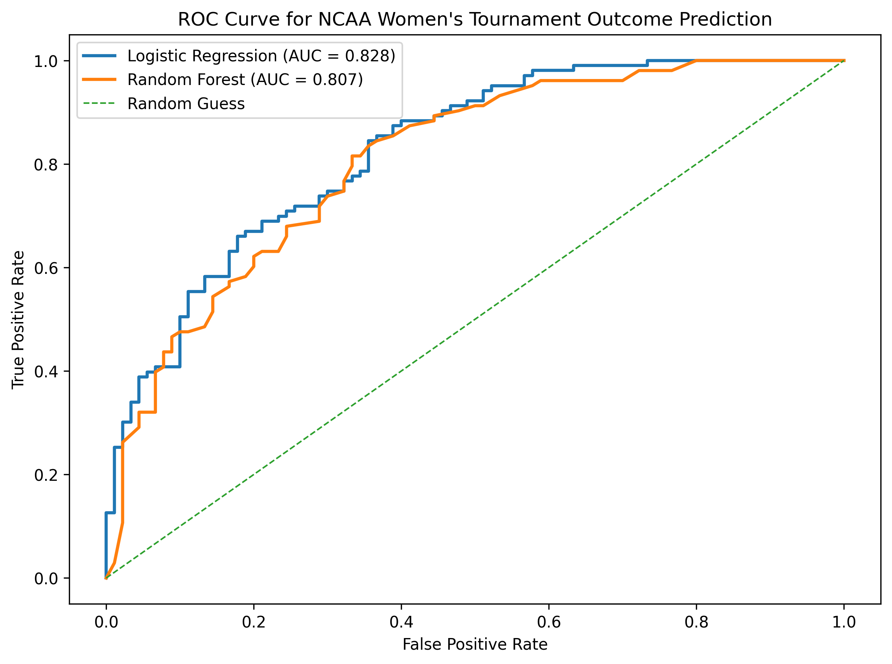

## Data Preparation

The pipeline begins by loading raw NCAA women’s basketball datasets, including regular season results, tournament results, and tournament seeds. Because the datasets cover different time periods, the analysis is restricted to seasons where all datasets overlap to ensure complete data and avoid missing values.

The raw data is transformed into a relational structure consisting of four tables: teams, seasons, regular_season_team_stats, and tournament_games. This structure separates team identity, season information, performance metrics, and tournament outcomes, allowing for clean joins and efficient querying.

## Data Preparation

The pipeline begins by loading raw NCAA women’s basketball datasets, including regular season results, tournament results, and tournament seeds.

Because these datasets cover different time periods, the analysis is restricted to seasons where all datasets overlap. This ensures complete data coverage and avoids systematic missing values.

The raw data is transformed into a relational structure consisting of four tables:
- teams
- seasons
- regular_season_team_stats
- tournament_games

This structure separates team identity, season information, performance metrics, and tournament outcomes.


```python
import pandas as pd
import numpy as np
import duckdb
import logging
import sys

# -----------------------------
# Logging setup
# -----------------------------
logging.basicConfig(
    level=logging.INFO,
    format="%(asctime)s | %(levelname)s | %(message)s",
    handlers=[
        logging.FileHandler("project1_pipeline.log", mode="w"),
        logging.StreamHandler(sys.stdout)
    ]
)

logger = logging.getLogger(__name__)

def check_required_columns(df, required_cols, name):
    missing = [col for col in required_cols if col not in df.columns]
    if missing:
        raise ValueError(f"{name} missing columns: {missing}")

try:
    logger.info("Starting pipeline")

    # Load data
    reg = pd.read_csv("WRegularSeasonDetailedResults.csv")
    tourney = pd.read_csv("WNCAATourneyCompactResults.csv")
    seeds = pd.read_csv("WNCAATourneySeeds.csv")
    teams_raw = pd.read_csv("WTeams.csv")

    # Validate
    check_required_columns(reg, ["Season","WTeamID","LTeamID","WScore","LScore"], "reg")
    check_required_columns(tourney, ["Season","WTeamID","LTeamID"], "tourney")
    check_required_columns(seeds, ["Season","TeamID","Seed"], "seeds")

    # Restrict seasons
    common_seasons = sorted(
        set(reg["Season"]).intersection(tourney["Season"]).intersection(seeds["Season"])
    )
    reg = reg[reg["Season"].isin(common_seasons)]
    tourney = tourney[tourney["Season"].isin(common_seasons)]
    seeds = seeds[seeds["Season"].isin(common_seasons)]

    # Teams
    teams = teams_raw[["TeamID","TeamName"]].drop_duplicates()

    # Seasons
    seasons = pd.DataFrame({"Season": common_seasons})

    # Regular season stats
    wins = reg.groupby(["Season","WTeamID"]).agg(
        Wins=("WTeamID","size"),
        AvgScore_W=("WScore","mean")
    ).reset_index().rename(columns={"WTeamID":"TeamID"})

    losses = reg.groupby(["Season","LTeamID"]).agg(
        Losses=("LTeamID","size"),
        AvgScore_L=("LScore","mean")
    ).reset_index().rename(columns={"LTeamID":"TeamID"})

    stats = pd.merge(wins, losses, on=["Season","TeamID"], how="outer")

    stats = stats.fillna(0)
    stats["GamesPlayed"] = stats["Wins"] + stats["Losses"]
    stats["WinPct"] = stats["Wins"] / stats["GamesPlayed"]
    stats["AvgScore"] = (
        stats["AvgScore_W"] * stats["Wins"] +
        stats["AvgScore_L"] * stats["Losses"]
    ) / stats["GamesPlayed"]

    stats = stats.fillna(0)

    stats = stats[["Season","TeamID","AvgScore","GamesPlayed","Wins","Losses","WinPct"]]

    # Seeds
    seeds["SeedNum"] = seeds["Seed"].str.extract(r"(\d+)").astype(int)

    # Tournament table
    t = tourney.rename(columns={"WTeamID":"WinnerID","LTeamID":"LoserID"})

    np.random.seed(42)
    mask = np.random.rand(len(t)) < 0.5

    t["Team1ID"] = np.where(mask, t["WinnerID"], t["LoserID"])
    t["Team2ID"] = np.where(mask, t["LoserID"], t["WinnerID"])
    t["Team1Win"] = (t["Team1ID"] == t["WinnerID"]).astype(int)

    t = t.merge(seeds[["Season","TeamID","SeedNum"]].rename(columns={
        "TeamID":"Team1ID","SeedNum":"Team1Seed"}), on=["Season","Team1ID"], how="left")

    t = t.merge(seeds[["Season","TeamID","SeedNum"]].rename(columns={
        "TeamID":"Team2ID","SeedNum":"Team2Seed"}), on=["Season","Team2ID"], how="left")

    t["GameID"] = range(1, len(t)+1)

    tournament_games = t[["GameID","Season","Team1ID","Team2ID","Team1Seed","Team2Seed","Team1Win"]]

    # Save tables
    teams.to_csv("teams.csv", index=False)
    seasons.to_csv("seasons.csv", index=False)
    stats.to_csv("regular_season_team_stats.csv", index=False)
    tournament_games.to_csv("tournament_games.csv", index=False)

    logger.info("Relational tables created")

except Exception as e:
    logger.exception("Pipeline failed")
```

## Query to Create Modeling Dataset

The final modeling dataset is created by joining the tournament_games table with the regular_season_team_stats table twice: once for Team 1 and once for Team 2.

This produces a matchup-level dataset where each row represents a tournament game. Additional features such as score differential, win percentage differential, and seed differential are computed to compare the two teams.

## Loading Data into DuckDB

The relational tables are loaded into DuckDB to enable SQL-based querying. This allows the pipeline to demonstrate relational database operations as required.


```python
con = duckdb.connect("ncaa_project.duckdb")

con.execute("CREATE OR REPLACE TABLE teams AS SELECT * FROM read_csv_auto('teams.csv')")
con.execute("CREATE OR REPLACE TABLE seasons AS SELECT * FROM read_csv_auto('seasons.csv')")
con.execute("CREATE OR REPLACE TABLE regular_season_team_stats AS SELECT * FROM read_csv_auto('regular_season_team_stats.csv')")
con.execute("CREATE OR REPLACE TABLE tournament_games AS SELECT * FROM read_csv_auto('tournament_games.csv')")

final_model_df = con.execute("""
SELECT
    tg.GameID,
    tg.Season,
    tg.Team1ID,
    tg.Team2ID,
    tg.Team1Seed,
    tg.Team2Seed,
    rs1.AvgScore AS Team1AvgScore,
    rs2.AvgScore AS Team2AvgScore,
    rs1.WinPct AS Team1WinPct,
    rs2.WinPct AS Team2WinPct,
    rs1.AvgScore - rs2.AvgScore AS ScoreDiff,
    rs1.WinPct - rs2.WinPct AS WinPctDiff,
    tg.Team2Seed - tg.Team1Seed AS SeedDiff,
    tg.Team1Win
FROM tournament_games tg
LEFT JOIN regular_season_team_stats rs1
    ON tg.Season = rs1.Season AND tg.Team1ID = rs1.TeamID
LEFT JOIN regular_season_team_stats rs2
    ON tg.Season = rs2.Season AND tg.Team2ID = rs2.TeamID
""").df()

print(final_model_df.isnull().sum())
```

    GameID           0
    Season           0
    Team1ID          0
    Team2ID          0
    Team1Seed        0
    Team2Seed        0
    Team1AvgScore    0
    Team2AvgScore    0
    Team1WinPct      0
    Team2WinPct      0
    ScoreDiff        0
    WinPctDiff       0
    SeedDiff         0
    Team1Win         0
    dtype: int64


## Model Implementation

To predict NCAA tournament game outcomes, I implemented two models: logistic regression and random forest.

Logistic regression was chosen because it is interpretable and allows for understanding how each feature contributes to win probability. Random forest was included as a more flexible model capable of capturing nonlinear relationships.

Comparing these models allows for evaluating whether a simple or more complex approach performs better for this prediction task.


```python
from sklearn.model_selection import train_test_split
from sklearn.linear_model import LogisticRegression
from sklearn.ensemble import RandomForestClassifier
from sklearn.metrics import roc_auc_score, accuracy_score

X = final_model_df[["ScoreDiff","WinPctDiff","SeedDiff"]]
y = final_model_df["Team1Win"]

X_train, X_test, y_train, y_test = train_test_split(X,y,test_size=0.2,random_state=42)

# Logistic Regression
log = LogisticRegression(max_iter=1000)
log.fit(X_train,y_train)
log_auc = roc_auc_score(y_test, log.predict_proba(X_test)[:,1])

# Random Forest
rf = RandomForestClassifier(random_state=42)
rf.fit(X_train,y_train)
rf_auc = roc_auc_score(y_test, rf.predict_proba(X_test)[:,1])

print("Logistic AUC:", log_auc)
print("Random Forest AUC:", rf_auc)
```

    Logistic AUC: 0.8276159654800431
    Random Forest AUC: 0.806957928802589


## Analysis Rationale

The model uses score differential, win percentage differential, and seed differential because these variables capture team performance and tournament expectations in a simple and interpretable way.

A train-test split is used to evaluate model performance on unseen data. AUC is chosen as the primary metric because it measures how well the model distinguishes between wins and losses across all thresholds, making it more appropriate than accuracy for this classification problem.

## Results Interpretation

The logistic regression model achieved an AUC of 0.828, outperforming the random forest model, which achieved an AUC of 0.807.

This suggests that a simple linear model is sufficient to capture the relationship between team performance and tournament outcomes. The results indicate that the selected features like score differential, win percentage differential, and seed differential, are strong predictors of success and do not require complex nonlinear modeling.

## Visualization


```python
from sklearn.metrics import roc_curve, roc_auc_score
import matplotlib.pyplot as plt

# ROC data
log_fpr, log_tpr, _ = roc_curve(y_test, log.predict_proba(X_test)[:, 1])
rf_fpr, rf_tpr, _ = roc_curve(y_test, rf.predict_proba(X_test)[:, 1])

plt.figure(figsize=(8, 6))
plt.plot(log_fpr, log_tpr, linewidth=2, label=f"Logistic Regression (AUC = {log_auc:.3f})")
plt.plot(rf_fpr, rf_tpr, linewidth=2, label=f"Random Forest (AUC = {rf_auc:.3f})")
plt.plot([0, 1], [0, 1], linestyle="--", linewidth=1, label="Random Guess")

plt.title("ROC Curve for NCAA Women's Tournament Outcome Prediction")
plt.xlabel("False Positive Rate")
plt.ylabel("True Positive Rate")
plt.legend()
plt.tight_layout()
plt.savefig("roc_curve_comparison.png", dpi=300, bbox_inches="tight")
plt.show()
```


    

    


## Visualization Rationale

I used a Receiver Operating Characteristic (ROC) curve to evaluate and compare model performance because it provides a comprehensive view of how well each model distinguishes between wins and losses across all possible classification thresholds. Unlike a single metric such as accuracy, the ROC curve captures the tradeoff between true positive rate and false positive rate, making it more appropriate for assessing binary classification models.

The ROC curve also allows for direct visual comparison between logistic regression and random forest, showing which model performs better across different decision boundaries. Including the diagonal “random guess” line provides a clear baseline for comparison, making it easy to interpret model effectiveness.
This visualization provides both a performance comparison and an interpretable understanding of the model, making it well-suited for communicating results in a clear and meaningful way.
